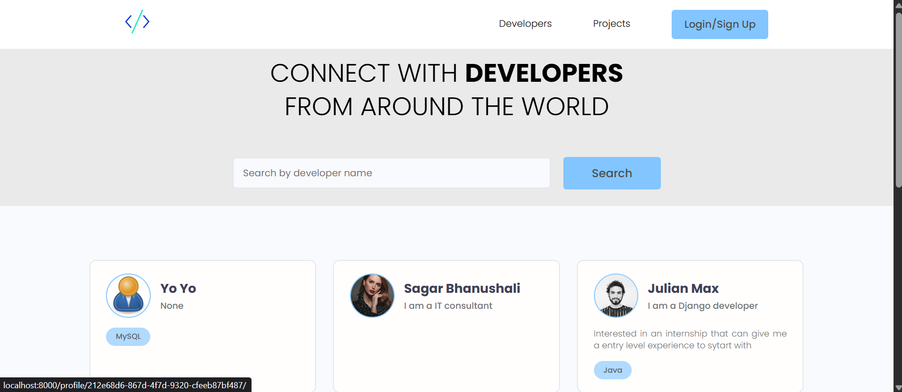
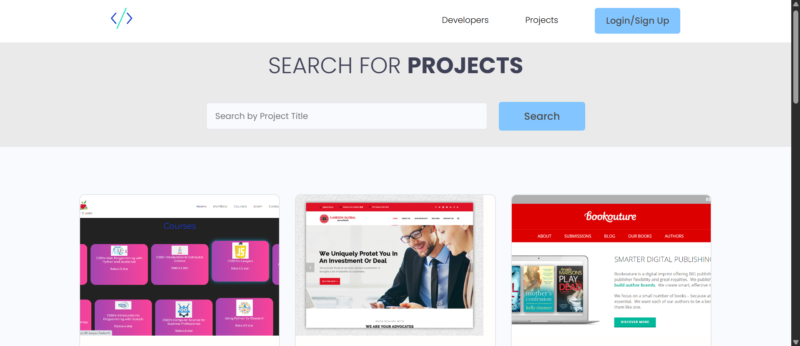
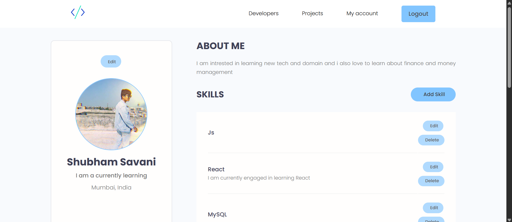

# DevMesh

Welcome to **DevMesh** — a developer networking platform built to help developers connect, collaborate, and showcase their work. Users can create profiles, share projects, interact with other developers, and communicate directly through messaging features.

## Features
- JWT Authentication & Authorization
- Developer Profiles and Portfolio Management
- Project Upload and Showcase
- Direct Messaging System
- Search and Filtering for Developers & Projects
- Ratings and Feedback System
- Pagination for Better User Experience
- REST API Integration
- Responsive UI for Seamless Access Across Devices

## Tech Stack
- Django
- Django REST Framework
- PostgreSQL
- HTML, CSS, JavaScript
- AWS S3
- Heroku

<!-- ## Live Deployment -->

## Preview

<!-- 
 -->

Thank you for checking out **DevMesh** 🚀